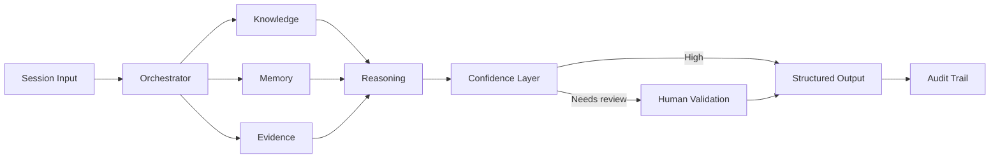

# AI Clinical Intelligence — Architecture Case Study

> Public, sanitized architecture study. No patient data, credentials or proprietary clinical records are included.

## Problem

A clinical workflow receiving conversational information needs more than a single LLM response. Useful AI assistance requires longitudinal context, evidence, confidence management, auditability and explicit human validation.

## Solution concept

I designed an evolution from a synchronous AI pipeline toward a modular event-driven architecture where specialized engines can process session changes, context, contradictions, goals, temporal signals and longitudinal evolution.

## Key design decisions

- **Human-in-the-loop:** uncertain outputs are routed for review instead of being silently treated as facts.
- **Evidence separation:** observations, evidence and generated reasoning remain distinguishable.
- **Longitudinal memory:** relevant context can persist across sessions without treating every historical datum equally.
- **Traceability:** important AI operations generate auditable events.
- **Modular engines:** reasoning capabilities can evolve independently rather than creating one opaque monolithic prompt.

## Confidence workflow

A three-band confidence model can distinguish high-confidence structured information, review-required information and low-confidence observations. The exact thresholds are configurable according to domain requirements.

## What this demonstrates

This case demonstrates my approach to AI solution architecture: the LLM is one component inside a governed system. Reliability comes from orchestration, evidence, memory, validation, traceability and carefully designed product flows.

## Scope

This document demonstrates architecture and product reasoning. It is not a medical device, does not provide clinical recommendations and intentionally excludes private implementation details.
