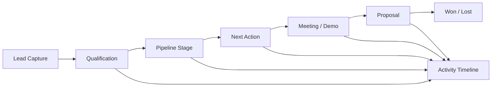

# CRM Intelligence & Automation — Case Study

## Problem

Commercial teams often accumulate disconnected leads, messages, meetings and follow-ups. A dashboard can look complete while still failing to answer the operational question: **what happened with this lead, what should happen next, and why?**

## Solution

I approach CRM design as a traceable business workflow rather than a collection of counters.

## Functional model

- Unified lead record and lifecycle.
- Persistent pipeline filters and meaningful stage transitions.
- Activity timeline across contact channels.
- Meeting lifecycle including modification and cancellation.
- Follow-up rules and next-action visibility.
- Dashboard metrics derived from real workflow states.
- AI-assisted prioritization can be layered on top of traceable operational data.

## AI opportunity

Once the underlying CRM has reliable state and history, AI can support lead summaries, follow-up suggestions, risk detection, prioritization and conversational interfaces. AI should augment a coherent process, not hide fragmented data.

## What this demonstrates

Business analysis, product architecture, workflow modeling and the ability to turn operational pain points into a system that can be implemented and measured.
