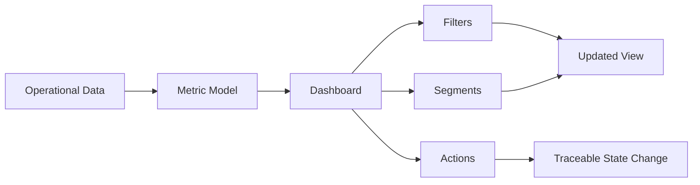

# Nexora SaaS Intelligence Dashboard — Product Case Study

## Challenge

A dashboard can contain attractive cards and charts yet still feel meaningless when metrics are disconnected, interactions do not affect state and the user cannot understand what the product is measuring.

## Design objective

Transform the interface into an operational surface where every major metric has context, controls produce visible state changes and related information forms a coherent narrative.

## Principles applied

- Remove unnecessary internal scroll areas and competing navigation patterns.
- Give every control a real purpose and state.
- Make metrics internally consistent.
- Connect overview KPIs with the detail that explains them.
- Use hierarchy, spacing and motion to improve comprehension rather than decoration.
- Preserve responsiveness and interaction quality across viewport sizes.

## Experience stack

Next.js · TypeScript · Tailwind CSS · GSAP · Framer Motion · Lenis

## What this demonstrates

Product critique, AI-directed iteration, UI systems thinking and the ability to evolve an initial prototype into a more coherent software experience.
