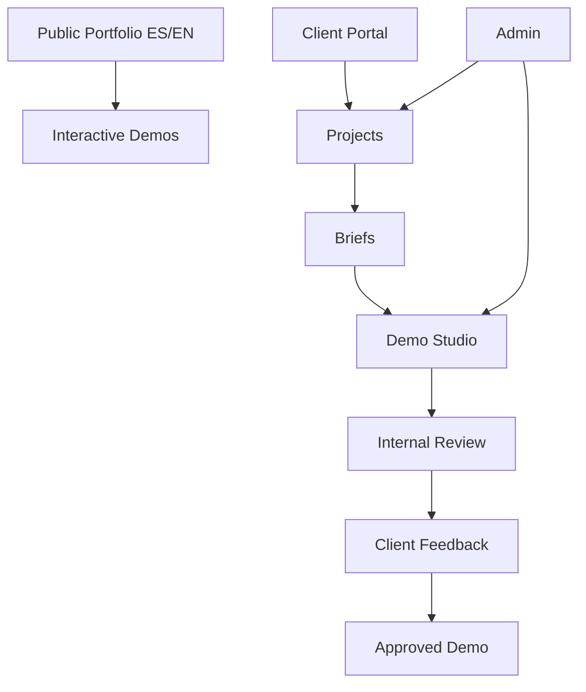

# Portfolio OS / AI Demo Studio — Case Study

## Objective

Create more than a static portfolio: an operating system for demonstrating digital products, managing client projects and producing AI-assisted demos.

## System map

## Lifecycle

`REQUESTED → BRIEFING → IN_PROGRESS → INTERNAL_REVIEW → DEMO_READY → FEEDBACK → APPROVED / ARCHIVED`

## Product architecture

The concept separates public presentation from private client operations while maintaining a shared project lifecycle. Core entities include users, clients, projects, briefs, demo versions, deployments, feedback, notifications and activity history.

## AI role

AI assists the demo-production workflow: interpreting briefs, accelerating interface generation, producing alternative concepts and supporting iteration. Human review remains a formal stage before client delivery.

## Product decisions

- Bilingual ES/EN architecture from the beginning rather than retrofitted translation.
- Public demos separated from private client artifacts.
- Versioned feedback loop.
- Role separation between ADMIN and CLIENT.
- Activity history for operational traceability.

## What this demonstrates

AI-assisted product design, SaaS workflow modeling, lifecycle architecture and the ability to turn a portfolio into an operational product.
